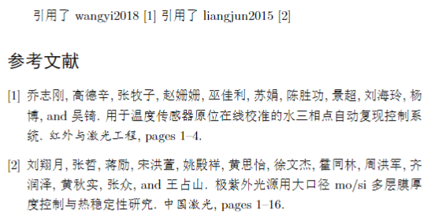
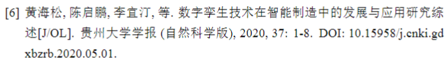

参考文档：https://www.latex-project.org/help/documentation/clsguide.pdf

- class和package的区分

如果这些命令可以被用于其他文档类，则应该把它们制作成package，否则为class

class后缀：.cls

package后缀：.sty

- class和package的一般结构

identification：定义文件类型（class/package），包含简短的描述

preliminary declarations：对一些命令的声明（通常用于处理options），导入其他所需文件

options：声明和处理options

more declarations：通常是文件的主体部分，完成主要的功能

- options

处理和执行options：

```latex
\ProcessOptions\relax
```

- class file必须包含的4个东西

a definition of `\normalsize`

values for `\textwidth` and `textheight`

a specification for page-numbering，页码

minimal class file 的示例：

```latex
\NeedsTeXFormat{LaTeX2e}
\ProvidesClass{minimal}[2022-06-01 Standard LaTeX minimal class]
\renewcommand{\normalsize}{\fontsize{10pt}{12pt}\selectfont}
\setlength{\textwidth}{6.5in}
\setlength{\textheight}{8in}
\pagenumbering{arabic}
```

- 其他

避免文件名中出现空格

###### 文献引用

导入bib文件：

```latex
% 注意：开头不要使用命令\usepackage{cite}，否则可能报错
\bibliographystyle{unsrt} % 引用样式 unsrt为按照引用顺序编号
\bibliography{reference} % reference为bib文件的名称
```

注意：bib文件中的作者姓名若有多个，需要用“and”连接，否则可能出现奇怪的错误。

###### 插入matlab代码

导入宏包：

```latex
\usepackage{matlab-prettifier}
```

插入matlab代码：

```latex
\begin{lstlisting}[style=Matlab-editor]
matlab code
\end{lstlisting}
```

参考：[How can I include MATLAB code in my LaTeX document?](https://cn.overleaf.com/learn/latex/Questions/How_can_I_include_MATLAB_code_in_my_LaTeX_document%3F)

###### 无序标题加入目录

适用于参考文献、附录程序等

```latex
\newpage
%
\section*{附录：实验程序}
% 将附录添加到目录中
\addcontentsline{toc}{section}{附录：实验程序}
```

###### 中英文摘要

自定义格式：

```latex
%中英文摘要 自定义格式
\newcommand{\enabstractname}{Abstract}
\newcommand{\cnabstractname}{摘要}
\newenvironment{enabstract}{%
    \par %\small %设置字体为small
    \noindent\mbox{}\hfill{\bfseries\enabstractname}\hfill\mbox{}\par
    \vskip 2.5ex}{\par\vskip2.5ex}
\newenvironment{cnabstract}{%
    \par %\small %设置字体为small    
    \noindent\mbox{}\hfill{\bfseries\cnabstractname}\hfill\mbox{}\par
    \vskip 2.5ex}{\par\vskip2.5ex}
```

使用示例：

```latex
% 中文摘要
\begin{cnabstract}
    这里是中文摘要    
    \vspace{10pt} % 指定行间距
    \noindent \textbf{关键词}：这里是关键词
\end{cnabstract}
\clearpage

% 英文摘要
\begin{enabstract}
    This is abstract.    
    \vspace{10pt} % 指定行间距
    \noindent \textbf{Keywords:}: This is keywords
\end{enabstract}
\clearpage
```

###### 数学公式引用

```latex
\begin{equation}\label{eq:1}
    P = \frac{1}{2}\rho Av^3 C_p 
\end{equation}
现在引用公式\label{eq:1}
```

###### 章节标题设置

```latex
%% 章节标题样式设置 例如“第1章”
% 靠左 阿拉伯数字 加粗
\usepackage{titlesec}
\titleformat{\section}{\Large\bfseries}{第\,\thesection\,章}{1em}{}
% 目录标题样式设置
\usepackage{titletoc}
\titlecontents{section}[0pt]{\addvspace{1.5pt}\filright\bf}
               {\contentspush{第\thecontentslabel\ 章\quad}}
               {}{\titlerule*[8pt]{.}\contentspage}
```

参考：LaTeX 怎么调节目录编号为“第几章”？ - Afterglow的回答 - 知乎
https://www.zhihu.com/question/59347224/answer/1894759717

###### 注意事项

- 使用其他编辑器如WPS打开latex工作文件夹中的PDF文件时，编译将会失败

### 常用代码

```latex
% 插入图片
\begin{figure}[H]
    \centering % 居中 
    % 图片文件的相对路径
    \includegraphics[width=.6\textwidth]{figure/地质钻探的钻机结构.png} 
    \caption{地质钻探的钻机结构} % caption是图片的标题
    \label{fig:地质钻探的钻机结构} % 此处的label相当于一个图片的专属标志，目的是方便上下文的引用
    % 图片引用格式：\ref{fig:img} 可能需要二次编译
\end{figure}
```

```latex
% 插入代码
\begin{lstlisting}
    hello world
\end{lstlisting}
```

```latex
% 有序列表
\begin{enumerate}
    \item line
\end{enumerate}
% 无序列表
\begin{itemize}
    \item line
\end{itemize}
```

```latex
\begin{titlepage}
% 导入封面
\includepdf[pages={1}]{./cover/cover.pdf}
\end{titlepage}

% 生成目录
\tableofcontents
\cleardoublepage
```

# 自定义class和package

##### 使用class和package

在自己创建的class和package中加载其他class和package并使用它们的功能。

- 加载package：

```latex
\RequirePackage[<options>]{<package>}[<date>]
```

- 在自行创建的class中加载其他class：

```latex
\LoadClass[<options>]{<class-name>}[<date>]
```

该命令与`\documentclass`类似，它允许新创建的class可以基于其他class进行构建。

- 其他命令：

```latex
\LoadClassWithOptions{<class-name>}[<date>]
\RequirePackageWithOptions{<package>}[<date>]
```

而不要使用原始的`\input`命令

##### 自定义命令

推荐使用的命令（仅列举出一部分）

用于定义文档接口：

- `\newcommand`
- `\renewcommand`
- `\providecommand`

用于定义环境：

- `\NewDocumentEnvironment`
- `\newenvironment`

### commands for class and package writers

#### identification

- `\NeedsTeXFormat{<format-name>}[<release-date>]`

format-name：指定文件的处理格式，标准的格式名称为`LaTeX2e`

- `\ProvidesClass{<class-name>}[<release-info>]`
- `\ProvidesPackage{<package-name>}[<release-info>]`

创建class/package并提供描述

- `\ProvidesFile{<file-name>}[<release-info>]`

导入除主流class和package之外的文件

#### loading files

在已有的class和package的基础上构建自己的class/package

- `\RequirePackage[<options-list>]{<package-name>}[<release-info>]`
- `\RequirePackageWithOptions{<package-name>}[<release-info>]`

用于加载package，与`\usepackage`命令作用相同

- `\LoadClass[<options-list>]{<class-name>}[<release-info>]`
- `\LoadClassWithOptions{<class-name>}[<release-info>]`

用于加载class，只能用于class files，且最多只能使用一次；与命令`\documentclass`作用相同

#### delaying code

- `\AtEndOfClass{<code>}`
- `\AtEndOfPackage{<code>}`

上述命令中声明的`<code>`将在处理完整个文件后被执行

- `\AtBeginDocument{<code>}`
- `\AtEndDocument{<code>}`

上述命令中声明的`<code>`将在执行`\begin{document} / \end{document}`时被执行

#### creating and using keyval options

- `\DeclareKeys[<family>]{<declarations>}`

示例：

```latex
\DeclareKeys[mypkg]
{
    draft.if = @mypkg@draft,
    draft.usage = preamble,
    name.store = \@mypkg@name,
    name.usage = load,
    second-name.store = \@mypkg@other@name
}
```

- `\DeclareUnknownKeyHandler[<family>]{<code>}`

处理未定义的options

- `\ProcessKeyOptions[<family>]`

- `\SetKeys[<family>]{<keyvals>}`

#### passing options around

- `\PassOptionsToPackage{<options-list>}{<package-name>}`
- `\PassOptionsToClass{<options-list}{<class-name>}`

#### safe file commands

- `\IfFileExists{<file-name>}{<true>}{<false>}`
- `\InputIfFileExists{<file-name>}{<true>}{<false>}`

#### reporting errors, etc

- `\ClassError{<class-name>}{<error-text>}{<help-text>}`
- `\PackageError{<package-name>}{<error-text>}{<help-text>}`


# 待整理的内容

###### 学习资源

官方文档：

- https://www.latex-project.org/help/documentation/

overleaf LaTeX教程：https://www.overleaf.com/learn/latex/Learn_LaTeX_in_30_minutes

书籍：

- 黄新刚LaTeX笔记：https://github.com/huangxg/lnotes

#### 页眉页脚设置

```latex
% 设置当前和随后的页面样式
\pagestyle{<style>}
% 仅设置当前页面的样式
\thispagestyle{<style>}
```

预定义的页面样式<style>：

- `empty`: no headers or footers on pages
- `plain`: no page headers, footers consist of a centered page number
- `headings`: no footers, headers contains class-specific information and page number
- `myheadings`: no footers, headers contains page number and user-supplied information

##### `fancyhdr` package

设置页眉和页脚：

```latex
\fancyhead[locations]{content}
\fancyfoot[locations]{content}
\fancyhf[locations]{content}
```

*locations*指定了*content*显示的位置，其位置定义以及示意图如下：

- `O(Odd) / E(Even)`：奇/偶数页（右/左页）
- `H(Header) / F(Footer)`：页眉/页脚
- `L(Left) / C(Center) / R(Right)`：左/中/右区域


使用示例：

```latex
\fancyhead{} % 清除页眉设置
\fancyhead[RO,LE]{this is header content} % 在 右页右边 和 左页左边 区域显示
```

#### counter的用法

在LaTeX中，counter相当于编程语言中的整型变量，可以用于对section等的计数

参考：https://www.overleaf.com/learn/latex/Counters

#### LaTeX的一些基础命令

##### 分页命令

```latex
\clearpage
\cleardoublepage
```

上述命令用于结束当前页并打印所有待显示的图片和表格。对于双面打印的文档，`\cleardoublepage`会将接下来的一页作为右边的页面（也就是奇数页码的页面，这意味着可能需要插入空白页）。

参考：

- https://latex2e.org/_005cclearpage-_0026-_005ccleardoublepage.html
- https://latex2e.org/Floats.html

##### 自定义命令

- `\newcommand`：定义新命令
- `\renewcommand`：重定义已有命令
- `\providecommand`：当命令不存在时，定义新命令；当命令已存在时，重新定义命令

#### 制作模板

overleaf 提供的教程：

- [Writing your own package](https://www.overleaf.com/learn/latex/Writing_your_own_package)
- [Writing your own class](https://www.overleaf.com/learn/latex/Writing_your_own_class)

overleaf 模板：https://cn.overleaf.com/latex/templates

参考资料：

- [如何写一个LaTeX类文件，并设计你自己的简历 ](https://www.cnblogs.com/super-zhang-828/p/7450133.html)

- [Can I write cls files in LaTeX instead of TeX?](https://stackoverflow.com/questions/3702222/can-i-write-cls-files-in-latex-instead-of-tex)

- [LaTeX2e for class and package writers guide](http://www.latex-project.org/guides/clsguide.pdf)

#### 字体设置

常见字号的对应关系参考：

- [Latex字体大小](https://blog.csdn.net/yhcwjh/article/details/116516011)

#### 图片和表格

- latex 表格单元格内分行的实现 - 大师姐的文章 - 知乎
  https://zhuanlan.zhihu.com/p/409241007

- 去掉图片和表格的标题中的冒号，并用空格代替：

```latex
% 去掉标题中的冒号 用空格代替
\usepackage{caption}
% 下面两行代码将冒号用空格代替，但是实测中空格没有添加成功
% \captionsetup[table]{labelsep=space} % 表
% \captionsetup[figure]{labelsep=space} % 图
% 采用自定义格式的方式进行修改
\DeclareCaptionLabelFormat{mylabel}{#1#2\hspace{1.5ex}}
\captionsetup[figure]{labelformat=mylabel,labelsep=none}
\captionsetup[table]{labelformat=mylabel,labelsep=none}
```

参考：[How to change spacing between caption numbering and text?](https://tex.stackexchange.com/questions/192449/how-to-change-spacing-between-caption-numbering-and-text)

#### 目录

使用tocloft宏包设置目录格式：

在目录中section和页码之间添加引导点：

```
\usepackage{tocloft}
\renewcommand{\cftsecleader}{\cftdotfill{\cftdotsep}}
```

其中，`\renewcommand`用于重定义命令，`\cftsecleader`用于定义section条目使用的引导线（通常定义为`\cftdotfill{\cft某dotsep}`），`\cftdotfill`命令用于绘制引导线，`\cftdotsep`命令指定了引导点之间的距离为默认距离。

有时为避免报错，可以在导入tocloft宏包时添加`subfigure`选项，即：

```
\usepackage[subfigure]{tocloft}
```

#### 摘要

设置摘要部分的字体样式：

```latex
\renewcommand{\abstractnamefont}{\fzlishu\bfseries\large} % 标题部分
\renewcommand{\abstracttextfont}{\fzkaiti} % 正文部分
```

参考：[Latex 摘要排版](https://blog.csdn.net/Happppppy_/article/details/106711999#:~:text=%E5%88%A9%E7%94%A8%E4%BB%A5%E4%B8%8B%E4%B8%A4%E4%B8%AA%E5%91%BD%E4%BB%A4%E8%AE%BE%E7%BD%AE%E6%91%98%E8%A6%81%E5%AD%97%E4%BD%93%EF%BC%9A%20renewcommand%7Babstractnamefont%7D%7Bfzlishubfserieslarge%7D%20renewcommand%7Babstracttextfont%7D%7Bfzkaiti%7D,1%202%20%E9%80%9A%E8%BF%87%E5%A6%82%E4%B8%8B%E5%91%BD%E4%BB%A4%E8%AE%BE%E7%BD%AE%E6%91%98%E8%A6%81%E6%A0%87%E9%A2%98%E4%B8%8E%E6%91%98%E8%A6%81%E5%86%85%E5%AE%B9%E7%9A%84%E9%97%B4%E8%B7%9D%EF%BC%9A%20setlength%7Babstitleskip%7D%7B-2em%7D)

### BibTex与文献数据库

##### 参考文献中作者名之间连接词“and”的处理

问题如下所示，可以看到除了连接词的问题，字体的样式也不统一。



可能的原因是unsrt格式无法对中文文献格式做特别处理，可采取的解决方法为：

注释掉参考文献导入处的格式设置代码：

```latex
% \bibliographystyle{unsrt}
```

并在导言区使用如下代码：

```latex
\usepackage{gbt7714}
% 如使用「顺序编码制」
\bibliographystyle{gbt7714-numerical}
% 如使用「著者-出版年制」方式的话，注释掉上一行，并将下一行取消注释
% \bibliographystyle{gbt7714-author-year}
```

最终效果（文献引用处的标号为上标，图中未展示）：



参考：

- Latex中文文献中的作者连接词用的是"and"，请问如何处理？ - 知乎用户的回答 - 知乎
  https://www.zhihu.com/question/337951090/answer/772632131

##### 文献的引用次序问题

在BibTex的基本文献格式中，unsrt格式根据文献在正文中的引用次序来排序，即正文中引用文献的编号从上至下依次递增，参考文献处列出的文献条目次序也与引用次序一致。效果图和代码如下：


```latex
% test.tex
\documentclass{article}
% 中文支持
\usepackage[UTF8]{ctex}    

\begin{document}
引用了wangyi2018 \cite{name2}
引用了liangjun2015 \cite{name1}

% unsrt:保持引用次序
\bibliographystyle{unsrt}
% 插入ref.bib文件
\bibliography{ref}

\end{document}
```

```latex
% ref.bib
@article{name1,
author = {  刘翔月 and     张哲 and     蒋励 and     宋洪萱 and     姚殿祥 and     黄思怡 and     徐文杰 and     霍同林 and     周洪军 and     齐润泽 and     黄秋实 and     张众 and 王占山},

title = {极紫外光源用大口径Mo/Si多层膜厚度控制与热稳定性研究},
journal = {中国激光},
 pages = {1-16},
issn = {0258-7025},
}    

@article{name2,
author = {  乔志刚 and     高德辛 and     张牧子 and     赵姗姗 and     巫佳利 and     苏娟 and     陈胜功 and     景超 and     刘海玲 and     杨博 and 吴锜},

title = {用于温度传感器原位在线校准的水三相点自动复现控制系统},
journal = {红外与激光工程},
 pages = {1-4},
issn = {1007-2276},
}    
```

参考资料：

- 在LaTeX中如何引用参考文献 - MOON学术论文写作的文章 - 知乎
  https://zhuanlan.zhihu.com/p/265479955

###### 其他

- 论文参考文献规范格式详解 - 小咸鱼的文章 - 知乎
  https://zhuanlan.zhihu.com/p/29513792

## LaTeX Package

### listings

- [listings – Typeset source code listings using LATEX](https://ctan.org/pkg/listings#:~:text=To%20use%2C%20usepackage%20%7Blistings%7D%2C%20identify%20the%20language%20of,in%20the%20form%20appropriate%20for%20the%20current%20language.)

## 论文写作格式基础

### 摘要

中英文摘要应当基本对应，且通常需要放在独立的页面中
